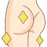

# LMAA - Leave me absolutely alone
## Browser extension that prevents sites from changing the favicon or tab title to distract you and get your attention

> I was super annoyed that several websites (Looking at you Slack/Linkedin) are trying to drag me back into their page by making the tab bar light up like snop dog on 20th of May. And don't get me started on these intercom "we miss you" messages. 

LMAA pins the browser favicon and title to the initial values when you first opened that page, persisting the state in local storage. 

**Give it a go and remove this little annoyance from your live**

- [Firefox Plugin](https://addons.mozilla.org/en-US/firefox/addon/lmaa-leave-me-absolutely-alone/)
- [Chrome extension](https://chrome.google.com/webstore/detail/lkakhhcedfjekighiccmikgcfcpahbli/)

For all the Germans out there: Yes, the LMAA acronym was chosen on purpose ;) 

---

Like that your life just got a little easier? [Buy me a coffee](https://paypal.me/51edpo)

---

[Butt icons created by Luvdat - Flaticon](https://www.flaticon.com/free-icons/butt)